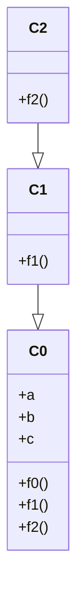
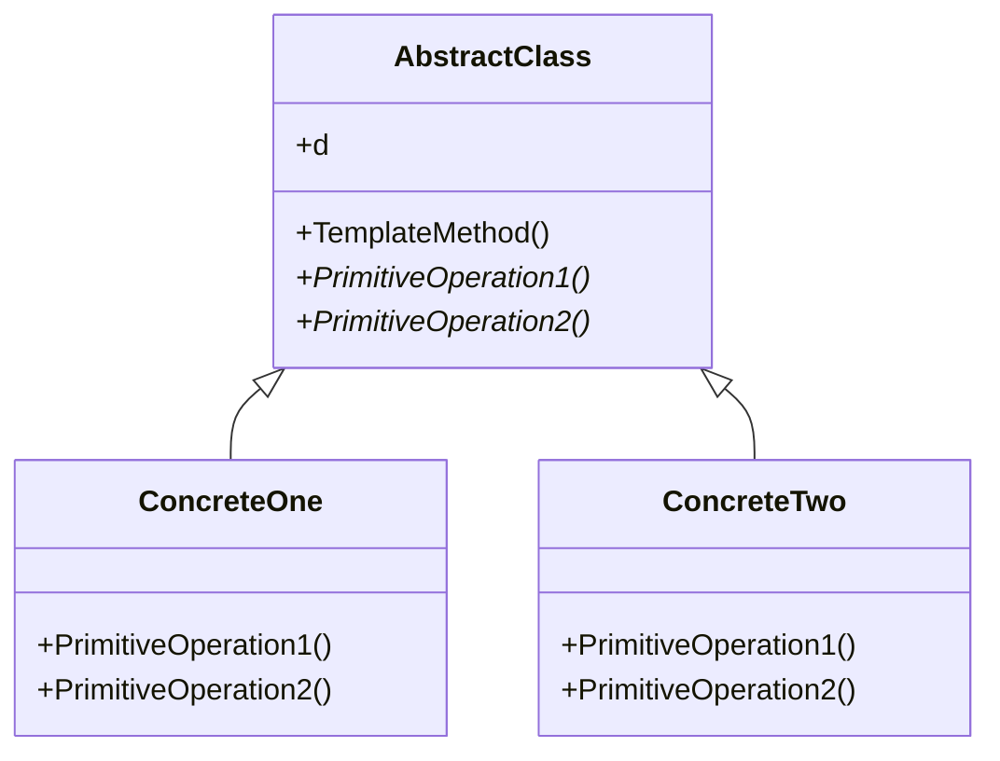
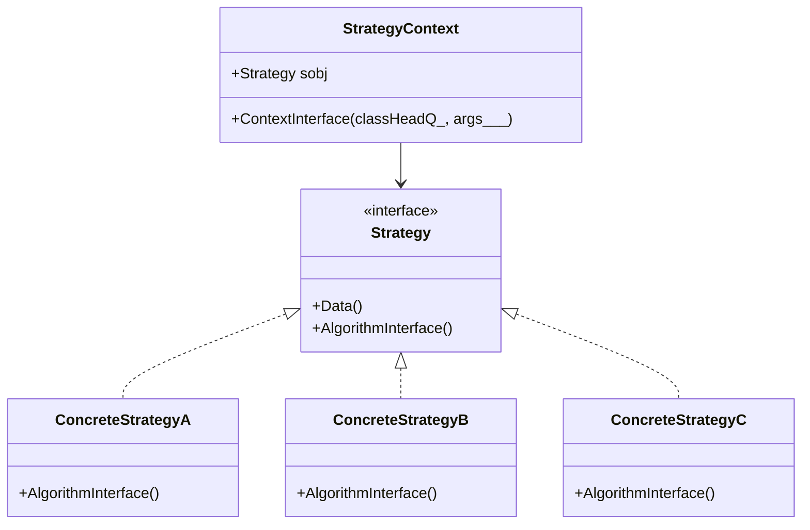

# Design Patterns (WL <-> Mermaid-JS)

## Class inheritance

```mathematica
Clear[C0, C1, C2]

C0[d_]["Data"[]] := d;
C0[{a_, b_, c_, ___}]["f0"[]] := a;
C0[{a_, b_, c_, ___}]["f1"[]] := a + b;
C0[{a_, b_, c_, ___}]["f2"[]] := a + b + c;

C1[d_][s_] := C0[d][s]
C1[{a_, b_, c_}]["f1"[]] := a*b;

C2[d_][s_] := C1[d][s]
C2[{a_, b_, c_}]["f2"[]] := a^b;
```



## Template Method

```mathematica
Clear[AbstractClass, ConcreteOne, ConcreteTwo];

CLASSHEAD = AbstractClass;
AbstractClass[d_]["Data"[]] := d;
AbstractClass[d_]["PrimitiveOperation1"[]] := None;
AbstractClass[d_]["PrimitiveOperation2"[]] := None;
AbstractClass[d_]["TemplateMethod"[]] := CLASSHEAD[d]["PrimitiveOperation1"[]] + CLASSHEAD[d]["PrimitiveOperation2"[]]

ConcreteOne[d_][s_] := Block[{CLASSHEAD = ConcreteOne}, AbstractClass[d][s]]
ConcreteOne[d_]["PrimitiveOperation1"[]] := d[[1]];
ConcreteOne[d_]["PrimitiveOperation2"[]] := d[[1]]*d[[2]];

ConcreteTwo[d_][s_] := Block[{CLASSHEAD = ConcreteTwo}, AbstractClass[d][s]]
ConcreteTwo[d_]["PrimitiveOperation1"[]] := d[[1]];
ConcreteTwo[d_]["PrimitiveOperation2"[]] := d[[3]]^d[[2]];
```



## Strategy

```mathematica
Clear[Strategy, StrategyContext, "ConcreteStrategy*"]

CLASSHEAD = Strategy;
Strategy[d__]["Data"[]] := d
Strategy[d__]["AlgorithmInterface"[args___]] := None;
ConcreteStrategyA[d__][s_] := Block[{CLASSHEAD = ConcreteStrategyA}, Strategy[d][s]];
ConcreteStrategyA[d__]["AlgorithmInterface"[args___]] := (StringJoin @@ Riffle[Map[ToString, {args}], ","]);
ConcreteStrategyB[d__][s_] := Block[{CLASSHEAD = ConcreteStrategyB}, Strategy[d][s]];
ConcreteStrategyB[d__]["AlgorithmInterface"[args___]] := Length /@ {args};
ConcreteStrategyC[d__][s_] := Block[{CLASSHEAD = ConcreteStrategyC}, Strategy[d][s]];
ConcreteStrategyC[d__]["AlgorithmInterface"[args___]] := Tread[{args} -> Range[Length[{args}]]];

StrategyContext[sobj_]["ContextInterface"[classHeadQ_, args___]] := Print[If[classHeadQ, ToString[Head[sobj]] <> " : ", ""], sobj["AlgorithmInterface"[args]]];
```

