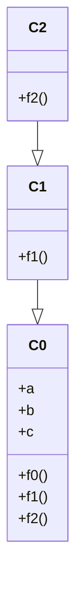
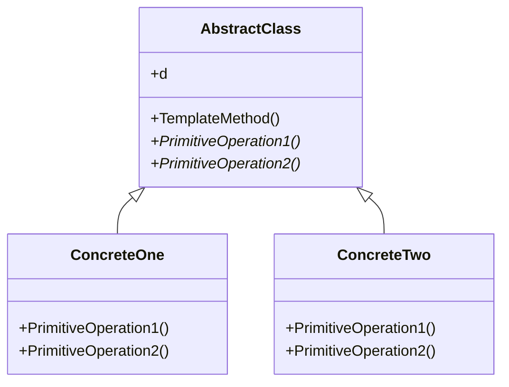
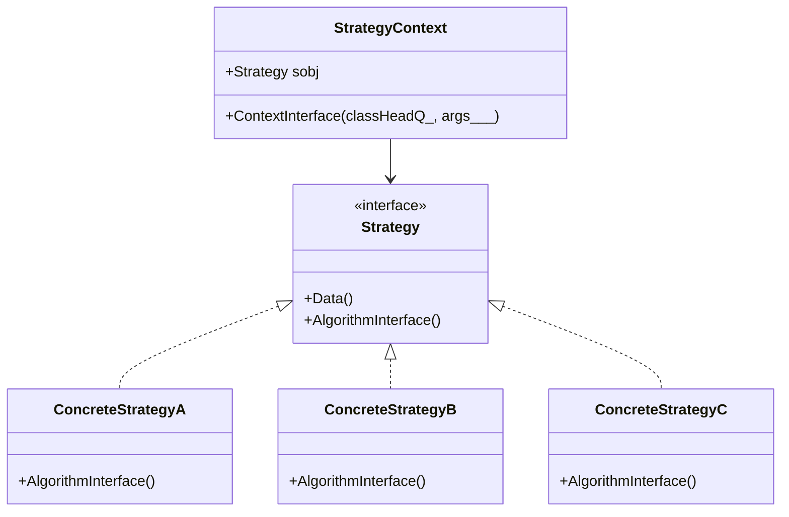
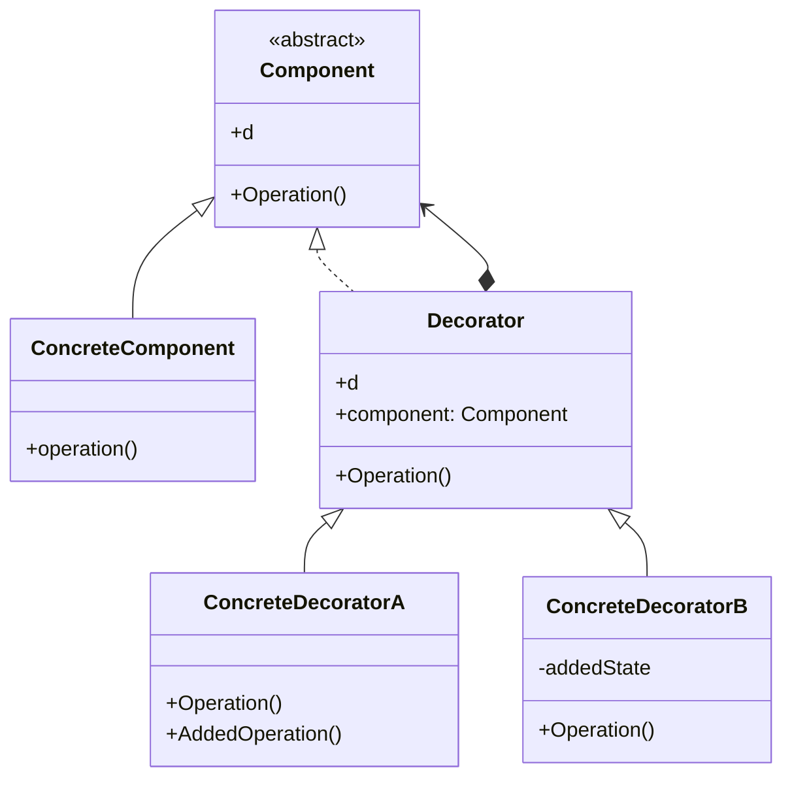
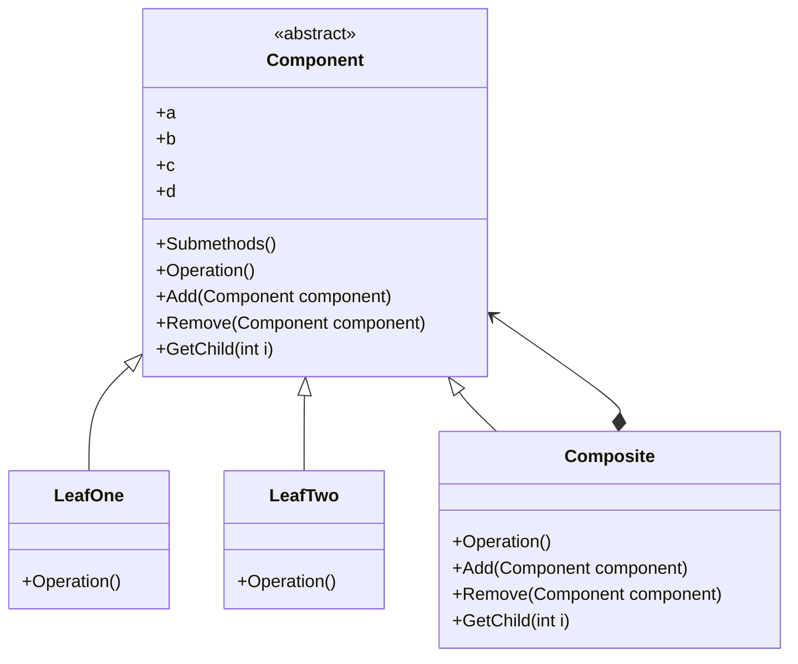
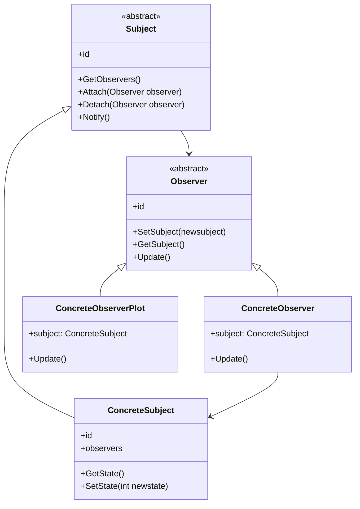

# Design Patterns (WL <-> Mermaid-JS)

## Class inheritance

```mathematica
Clear[C0, C1, C2]

C0[d_]["Data"[]] := d;
C0[{a_, b_, c_, ___}]["f0"[]] := a;
C0[{a_, b_, c_, ___}]["f1"[]] := a + b;
C0[{a_, b_, c_, ___}]["f2"[]] := a + b + c;

C1[d_][s_] := C0[d][s]
C1[{a_, b_, c_}]["f1"[]] := a*b;

C2[d_][s_] := C1[d][s]
C2[{a_, b_, c_}]["f2"[]] := a^b;
```



## Template Method

```mathematica
Clear[AbstractClass, ConcreteOne, ConcreteTwo];

CLASSHEAD = AbstractClass;
AbstractClass[d_]["Data"[]] := d;
AbstractClass[d_]["PrimitiveOperation1"[]] := None;
AbstractClass[d_]["PrimitiveOperation2"[]] := None;
AbstractClass[d_]["TemplateMethod"[]] := CLASSHEAD[d]["PrimitiveOperation1"[]] + CLASSHEAD[d]["PrimitiveOperation2"[]]

ConcreteOne[d_][s_] := Block[{CLASSHEAD = ConcreteOne}, AbstractClass[d][s]]
ConcreteOne[d_]["PrimitiveOperation1"[]] := d[[1]];
ConcreteOne[d_]["PrimitiveOperation2"[]] := d[[1]]*d[[2]];

ConcreteTwo[d_][s_] := Block[{CLASSHEAD = ConcreteTwo}, AbstractClass[d][s]]
ConcreteTwo[d_]["PrimitiveOperation1"[]] := d[[1]];
ConcreteTwo[d_]["PrimitiveOperation2"[]] := d[[3]]^d[[2]];
```



## Strategy

```mathematica
Clear[Strategy, StrategyContext, "ConcreteStrategy*"]

CLASSHEAD = Strategy;
Strategy[d__]["Data"[]] := d
Strategy[d__]["AlgorithmInterface"[args___]] := None;
ConcreteStrategyA[d__][s_] := Block[{CLASSHEAD = ConcreteStrategyA}, Strategy[d][s]];
ConcreteStrategyA[d__]["AlgorithmInterface"[args___]] := (StringJoin @@ Riffle[Map[ToString, {args}], ","]);
ConcreteStrategyB[d__][s_] := Block[{CLASSHEAD = ConcreteStrategyB}, Strategy[d][s]];
ConcreteStrategyB[d__]["AlgorithmInterface"[args___]] := Length /@ {args};
ConcreteStrategyC[d__][s_] := Block[{CLASSHEAD = ConcreteStrategyC}, Strategy[d][s]];
ConcreteStrategyC[d__]["AlgorithmInterface"[args___]] := Tread[{args} -> Range[Length[{args}]]];

StrategyContext[sobj_]["ContextInterface"[classHeadQ_, args___]] := Print[If[classHeadQ, ToString[Head[sobj]] <> " : ", ""], sobj["AlgorithmInterface"[args]]];
```



## Decorator

```mathematica
Clear[Component, ConcreteComponent, ConcreateDecoratorA, ConcreateDecoratorB, Decorator];

SELFHEAD = Component;
Component[d_]["Operation"[]] := Print["error"]

Decorator[d_, component_][s_] := Block[{SELFHEAD = Component}, component[s]]
Decorator[d_, component_]["Operation"[]] := (Print["Decorator:", Head[component]]; component["Operation"[]]);

ConcreteComponent[d_][s_] := Block[{SELFHEAD = ConcreteComponent}, Component[d][s]]
ConcreteComponent[d_]["Operation"[]] := Total[Flatten@{d}];

ConcreateDecoratorA[d_, component_][s_] := Block[{SELFHEAD = ConcreateDecoratorA}, Decorator[d, component][s]]
ConcreateDecoratorA[d_, component_]["Operation"[]] := Decorator[d, component]["Operation"[]]^d[[1]];
ConcreateDecoratorA[d_, component_]["AddedOperation"[]] := Decorator[d, component]["Operation"[]]^2;

ConcreateDecoratorB[d_, component_][s_] := Block[{SELFHEAD = ConcreateDecoratorB}, Decorator[d, component][s]]
ConcreateDecoratorB[d_, component_]["Operation"[]] := 1/Decorator[d, component]["Operation"[]];
```



## Composite

```mathematica
Clear[Component, LeafOne, LeafTwo, Composite];

CLASSHEAD = Component;
Component[d_, sm_]["Submethods"[]] := sm;
Component[{a_, b_, c_}, sm_]["Add"[obj_]] := CLASSHEAD[{a, b, c}, sm]["Add"[obj]];
Component[{a_, b_, c_}, sm_]["Remove"[obj_]] := CLASSHEAD[{a, b, c}, sm]["Remove"[obj]]; 
Component[{a_, b_, c_}, sm_]["GetChild"[i_Integer]] := CLASSHEAD[{a, b, c}, sm]["GetChild"[i]];
Component[d_, sm_]["Operation"[]] := Print["error"]

LeafOne[d_, sm_][s_] := Block[{CLASSHEAD = LeafOne}, Component[d, sm][s]]
LeafOne[{a_, b_, c_}, sm_]["Operation"[]] := a;

LeafTwo[d_, sm_][s_] := Block[{CLASSHEAD = LeafTwo}, Component[d, sm][s]]
LeafTwo[{a_, b_, c_}, sm_]["Operation"[]] := a^b^c;

Composite[d_, sm_][s_] := Block[{CLASSHEAD = Composite}, Component[d, sm][s]]
Composite[{a_, b_, c_}, sm_]["Add"[obj_]] := Composite[{a, b, c}, Append[sm, obj]];
Composite[{a_, b_, c_}, sm_]["Remove"[obj_]] := Composite[{a, b, c}, Select[sm, #1 =!= obj &]]; 
Composite[{a_, b_, c_}, sm_]["GetChild"[i_Integer]] := sm[[i]];
Composite[{a_, b_, c_}, sm_]["Operation"[]] := Map[#1["Operation"[]] &, sm];
```



## Observer

```mathematica
ClearAll[Subject, ConcreteSubject, Observer, ConcreteObserver, ConcreteObserverPlot];

SUBJECTHEAD = Subject;
(*SetAttributes[Subject,HoldAll]*)
Subject[id_Symbol]["GetObservers"[]] := SUBJECTHEAD[id]["Observers"];
Subject[id_Symbol]["Attach"[observer_]] := (SUBJECTHEAD[id]["Observers"] = Append[SUBJECTHEAD[id]["Observers"], observer]);
Subject[id_Symbol]["Detach"[observer_]] := (SUBJECTHEAD[id]["Observers"] = DeleteCases[SUBJECTHEAD[id]["Observers"], observer]);
Subject[id_Symbol]["Notify"[]] := Through[(SUBJECTHEAD[id]["Observers"])["Update"[]]];

ConcreteSubject[d___][s_] := Block[{SUBJECTHEAD = ConcreteSubject}, Subject[d][s]];
ConcreteSubject[id_Symbol, observers_] := Block[{}, ConcreteSubject[id]["Observers"] = observers; ConcreteSubject[id]];
ConcreteSubject[id_Symbol]["Data"] := {};
ConcreteSubject[id_Symbol]["GetState"[]] := ConcreteSubject[id]["Data"]; 
ConcreteSubject[id_Symbol]["SetState"[newstate_]] := (ConcreteSubject[id]["Data"] = newstate);

OBSERVERHEAD = Observer;
Observer[id_Symbol]["SetSubject"[newsubject_]] := (OBSERVERHEAD[id]["Subject"] = newsubject);
Observer[id_Symbol]["GetSubject"[]] := OBSERVERHEAD[id]["Subject"];

ConcreteObserver[id_Symbol, subject_] := Block[{}, ConcreteObserver[id]["Subject"] = subject; ConcreteObserver[id]];
ConcreteObserver[d___][s_] := Block[{OBSERVERHEAD = ConcreteObserver}, Observer[d][s]];
ConcreteObserver[id_Symbol]["Update"[]] := Grid[{{"observer id", "output"}, {id, ConcreteObserver[id]["GetSubject"[]]["GetState"[]]}}, Dividers -> All];

ConcreteObserverPlot[id_Symbol, subject_] := Block[{}, ConcreteObserverPlot[id]["Subject"] = subject; ConcreteObserverPlot[id]];
ConcreteObserverPlot[d___][s_] := Block[{OBSERVERHEAD = ConcreteObserverPlot}, Observer[d][s]];
ConcreteObserverPlot[id_Symbol]["Update"[]] := Grid[{{"observer id", "output"}, {id, Apply[Plot, ConcreteObserverPlot[id]["GetSubject"[]]["GetState"[]]]}}, Dividers -> All];
```

